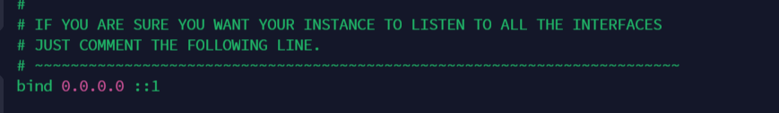

#### 目标

c++实现远程存储数据存入Redis数据库

#### 配置

基于Ubuntu系统安装:

##### 安装Redis服务器

```
sudo apt-get install redis-server
```

##### 启动Redis服务器:

一般来说，当安装完成后，Redis服务器会自动启动，可以通过以下命令检查是否启动成功。（ps：如果Active显示为 active(running) 状态：表示redis已在运行，启动成功）

```
service redis-server status
```


检查当前进程，查看redis是否启动。（ps: 可以看到redis服务正在监听6379端口）

```
ps -aux|grep redis-server
```


上面的127.0.0.1 是redis服务器的 IP 地址，6379 是 Redis 服务器运行的端口。

##### 开启关闭服务器

```
sudo systemctl stop redis
sudo systemctl start redis
sudo systemctl restart redis

sudo systemctl status redis
```


##### 设置为全部IP可访问

更改配置文件(Ubuntu路径,centos直接 ``/etc/redis.conf``)

```
sudo nano /etc/redis/redis.conf
```

将 ``127.0.0.1``改成 ``0.0.0.0``:



默认端口为6379，别忘了配置防火墙


### 命令

直接进入操作界面进行交互操作更加直观：

```
redis-cli

```

* **切换库指令**
  redis.conf配置中默认16个库，下标从0~15。进入客服端默认选中第0个库，可以通过select命令进行切换，index表示库的小标。

  ```shell
  127.0.0.1:6379> SELECT index
  ```
* **删除当前库的数据**
  删除当前选择的数据库中的所有数据，这个命令永远不会出现失败。

  ```shell
  127.0.0.1:6379[1]> FLUSHDB 
  ```
* **删除所有库的数据**
  删除所有数据库里面的数据，注意是所有数据库，这个命令永远不会出现失败。

  ```shell
  127.0.0.1:6379[1]> FLUSHALL
  ```
* **查看key的数量**
  查看当前选择的库中key的数量

  ```shell
  127.0.0.1:6379> DBSIZE
  ```
* **SET**
  set命令将key是定为指定的字符串，如果key存在，则会覆盖原来的值。

  ```shell
  SET key value [EX seconds] [PX milliseconds] [NX|XX]
  ```

  其中set可以为设定的值设置过期时间，EX表示秒数，PX表示毫秒。参数NX表示只有键key不存在的时候才会设置key的值，XX表示只有键key存在的时候才会设置key的值。
* **GET**
  get命令返回与键 `key` 相关联的字符串值。

  ```shell
  GET key
  ```

  如果key不存在，返回nil，如果key的值是非字符串类型，那么返回一个错误。

更多命令参考[链接](https://github.com/datawhalechina/fun-rec/blob/master/docs/ch03/ch3.2/3.2.1.3.md)  


### c++操作

直接调用第三方库实现即可:

运行将本代码与第三方库放在同一个文件夹下编译并运行

```cpp
#include "RedisConnect.h"
#include <iostream>

using namespace std;

int main(int argc, char** argv)
{
	string val;
 
	//初始化连接池
	RedisConnect::Setup("124.223.76.58", 6379);
 	// RedisConnect::Setup("127.0.0.1", 6379, "password"); // 本地连接，密码可不给
	//从连接池中获取一个连接
	shared_ptr<RedisConnect> redis = RedisConnect::Instance();
 
	//设置一个键值
	redis->set("ma", "kaka");
	cout << "插入成功" << endl;
	//获取键值内容
	cout << redis->get("ma") << endl;   // 看函数源码
 
 
	return 0;
}
```

以上实现了远程连接服务器(腾讯)的Redis数据库连接，并将一组数据(键值对格式)存入数据库并取出。


### 参考

[安装基础命令](https://github.com/datawhalechina/fun-rec/blob/master/docs/ch03/ch3.2/3.2.1.3.md)

[c++第三方库操作Redis](https://gitee.com/xungen/redisconnect)
