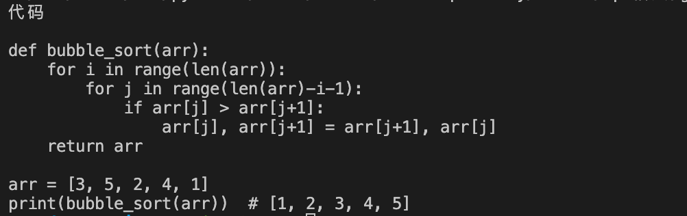
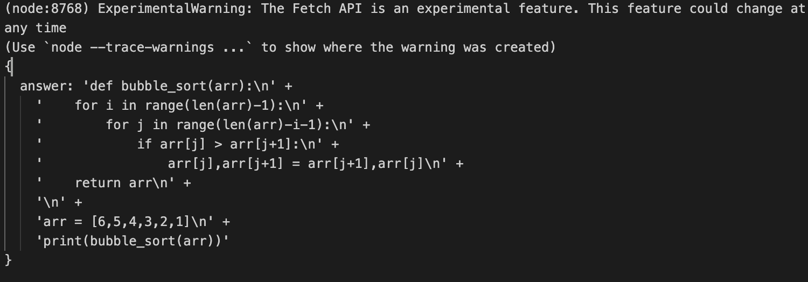

## 基础知识

### 定义

API 代表应用程序编程接口，是允许两个软件组件使用一组定义和协议相互通信的机制。例如，气象局的软件系统包括每天的天气数据。您手机上的天气应用程序通过 API 与该系统“对话”，并在您的手机上显示每天的最新天气信息。

### 原理

客户端携带数据请求服务器，服务器验证后作出响应，并将结果返回给客户端。

### 创建一个国内可访问chatgpt的api

原理是以国外服务器作为跳板，国内请求服务器(通过api)让其请求chatgpt，再将结果返回。

```js
nohup python app.py
```

### 调用

只需要向我的域名发送post请求即可，啥保护措施都没有，别干挂机了，谢谢。

这里用python和js写两种。

```python
import requests
import json

URL = 'http://43.153.21.199:5000/'

res = requests.post(URL, json={"question": "写一个冒泡排序 python"})

print(json.loads(res.text)['answer'])
```

返回：




```js
const fun = async function() {
    let res = await  fetch('http://43.153.21.199:5000/', {
            method: 'POST',
            headers: {
                'Content-Type': 'application/json'
            },
            body: JSON.stringify({question: '写一个冒泡排序 python'})
        })
    let data = await res.json();
    console.log(data)
  
}
fun()
```

结果(解析自己来吧我不会啦哈哈)：


