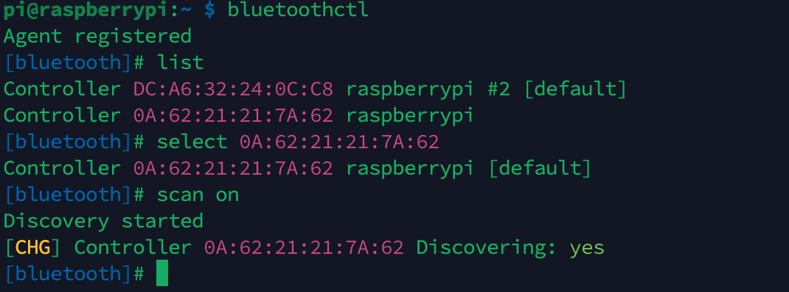
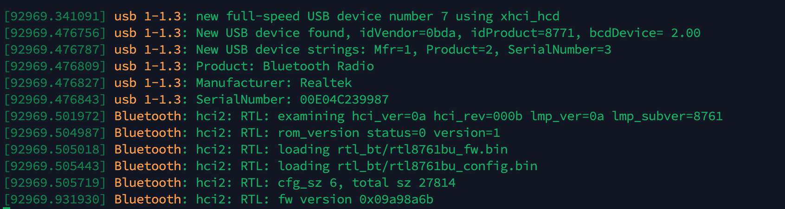
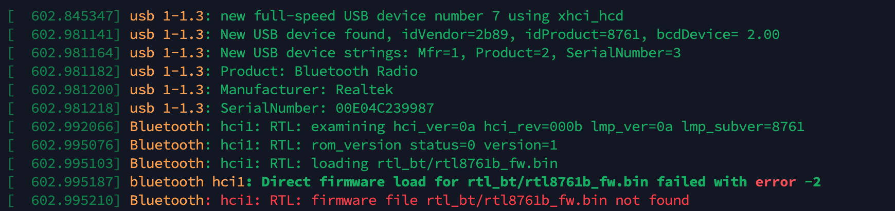

## 问题背景

绿联的usb dongle在树莓派上可以识别到但scan不出来任何东西。




dmesg -w

绿联


山泽（可以使用)



发现绿联的插进去系统并没有去加载驱动！

## 搜索


## 解决方案

镜像：legacy()，内核为5.15.84的不太行。


1、下载对应内核

使用 ``uname -r``查看内核版本下载对应的

```
wget https://cdn.kernel.org/pub/linux/kernel/v5.x/linux-5.10.103.tar.xz
tar xpvf linux-5.10.103.tar.xz
```


2、更改 `` btusb.c``文件

```
cd linux-5.10.103/drivers/bluetooth
sudo nano btusb.c
```

添加下面一行进去：

```
/* Tp-Link UB500 */
{ USB_DEVICE(0x2357, 0x0604), .driver_info = BTUSB_REALTEK },
```

其中前面是：USB 规范组织分配给 Linux USB 设备的厂商 ID，后面是：Linux USB 设备的产品 ID。

使用命令 ``lsusb``查询


3、可能不需要

4、编译


```
make -C /lib/modules/$(uname -r)/build M=$(pwd) clean
cp /usr/src/linux-headers-$(uname -r)/.config ./
cp /usr/src/linux-headers-$(uname -r)/Module.symvers Module.symvers
make -C /lib/modules/$(uname -r)/build M=$(pwd) modules
sudo cp btusb.ko /lib/modules/$(uname -r)/kernel/drivers/bluetooth
```

注：

第一步会报如下问题，涉及到内核编译需要装库


```
sudo apt-get install raspberrypi-kernel-headers
```


5、重新加载

```
sudo modprobe -r btusb
sudo modprobe -v btusb
```





6、解决驱动问题（此时无法扫描到)

下载驱动

```bash
wget https://raw.githubusercontent.com/Realtek-OpenSource/android_hardware_realtek/rtk1395/bt/rtkbt/Firmware/BT/rtl8761b_config
wget https://raw.githubusercontent.com/Realtek-OpenSource/android_hardware_realtek/rtk1395/bt/rtkbt/Firmware/BT/rtl8761b_fw
mv rtl8761b_config /lib/firmware/rtl_bt/rtl8761b_config.bin
mv rtl8761b_fw /lib/firmware/rtl_bt/rtl8761b_fw.bin
sudo modprobe btusb
sudo systemctl start bluetooth.service
```


## 参考

[dongle](https://askubuntu.com/questions/1370663/bluetooth-scan-doesnt-detect-any-device-on-ubuntu-21-10)

[驱动](https://askubuntu.com/questions/1339825/ubuntu-21-04-bluetooth-5-0-dongle-does-not-work-and-says-theres-no-firmware)
